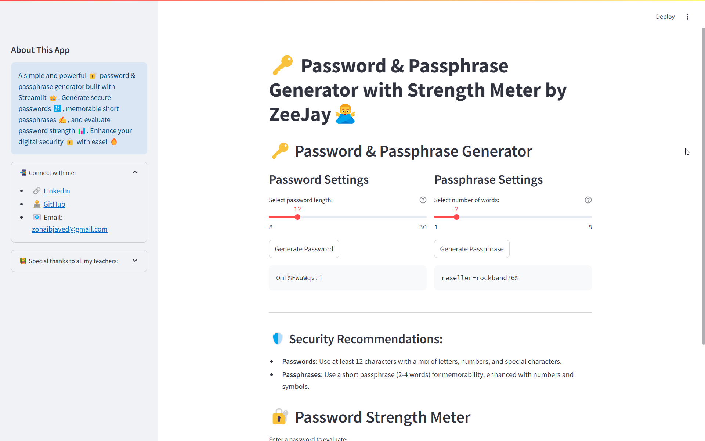
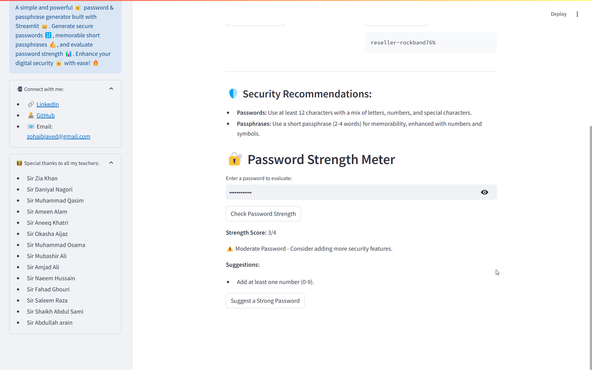

# 🔑 Password & Passphrase Generator with Strength Meter

A powerful and user-friendly password & passphrase generator built with **Streamlit**.  
🔐 Create **secure passwords**, generate **memorable passphrases**, and **evaluate password strength** in one place.  

---

## 🚀 Features

✅ **Generate Strong Passwords** – Secure, randomized passwords with numbers & special characters.  
✅ **Create Memorable Passphrases** – Short, easy-to-remember passphrases with a touch of randomness.  
✅ **Check Password Strength** – Analyze and improve your password security.  
✅ **User-Friendly Interface** – Simple & sleek UI powered by Streamlit.  
✅ **Sidebar Tools & Info** – Quick access to resources and contact links.  

---

## 📸 App Preview

### 🔑 Password & Passphrase Generator


### 🔐 Password Strength Meter


### 🎛️ Sidebar & Additional Tools


---

## 🌐 Live Demo

🔗 **Try it out:** [Live App Link](#) *(Replace with actual deployed link)*  

---

## 📥 Installation & Usage

1️⃣ **Clone the repository**  
```sh
git clone https://github.com/zohaib-javd/password-generator2.git
cd password-generator2
```

2️⃣ **Install dependencies**  
```sh
pip install -r requirements.txt
```

3️⃣ **Run the Streamlit app**  
```sh
streamlit run app.py
```

---

## 🛠️ Technologies Used

- **Python** 🐍
- **Streamlit** 🎈
- **Secrets Module** 🔒
- **Regex for Password Analysis** 🔍

---

## 👨‍💻 Connect with Me

📌 **Zohaib Javed**  
- 🔗 [LinkedIn](https://www.linkedin.com/in/zohaib-javd)  
- 👨‍💻 [GitHub](https://www.github.com/zohaib-javd)  
- 📧 Email: zohaibjaved@gmail.com  

---

## 🙌 Special Thanks

🧑‍🏫 To all my **teachers & mentors** for guiding me in my journey!  

- Sir Zia Khan  
- Sir Daniyal Nagori  
- Sir Muhammad Qasim  
- Sir Ameen Alam  
- Sir Aneeq Khatri  
- Sir Okasha Aijaz  
- Sir Muhammad Osama  
- Sir Mubashir Ali  
- Sir Amjad Ali  
- Sir Naeem Hussain  
- Sir Fahad Ghouri  
- Sir Saleem Raza  
- Sir Shaikh Abdul Sami  
- Sir Abdullah Arain  

---

## 📜 License

📝 This project is **open-source** and available under the **MIT License**.  

---

🔥 **Enjoy secure passwords & passphrases with ease!** 🚀

